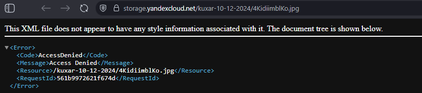

# CLOPRO-3-SEC

1. С помощью ключа в KMS необходимо зашифровать содержимое бакета:
создать ключ в KMS;
с помощью ключа зашифровать содержимое бакета, созданного ранее.

Создаем роль для KMS и симитричный ключ шифрования

```
resource "yandex_resourcemanager_folder_iam_member" "sa-editor-encrypter-decrypter" {
  folder_id = var.folder_id
  role      = "kms.keys.encrypterDecrypter"
  member    = "serviceAccount:${yandex_iam_service_account.service.id}"
}
resource "yandex_kms_symmetric_key" "secret-key" {
  name              = "key-1"
  description       = "ключ для шифрования бакета"
  default_algorithm = "AES_128"
  rotation_period   = "24h"
}
```
Далее дополняем бакет из предыдущий домашки
```
resource "yandex_storage_bucket" "kuxar" {
  access_key = yandex_iam_service_account_static_access_key.sa-static-key.access_key
  secret_key = yandex_iam_service_account_static_access_key.sa-static-key.secret_key
  bucket = local.bucket_name
  acl    = "public-read"
// дополнение
  server_side_encryption_configuration {
    rule {
      apply_server_side_encryption_by_default {
        kms_master_key_id = yandex_kms_symmetric_key.secret-key.id
        sse_algorithm     = "aws:kms"
      }
    }
  }
}

resource "yandex_storage_object" "picture" {
  access_key = yandex_iam_service_account_static_access_key.sa-static-key.access_key
  secret_key = yandex_iam_service_account_static_access_key.sa-static-key.secret_key
  bucket = local.bucket_name
  key    = "4KidiimblKo.jpg"
  source = "png/4KidiimblKo.jpg"
  acl = "public-read"
  depends_on = [yandex_storage_bucket.kuxar]


  }
  ```
Все успешно создалось. 
Картинка как и должно не появилась



достать ее можно при помощи WinSCP

Подключение

Запустите WinSCP.

На вкладке Sessions выберите New Session....

В блоке Sessions укажите следующие параметры:

File protocol — Amazon S3.

Host name — storage.yandexcloud.net.

Port number — 443.

Access key ID — идентификатор статического ключа, полученный ранее.

Secret access key — секретный ключ, полученный ранее.

Нажмите кнопку Login.


```
terraform output -raw access_key 

terraform output -raw secret_key
```

